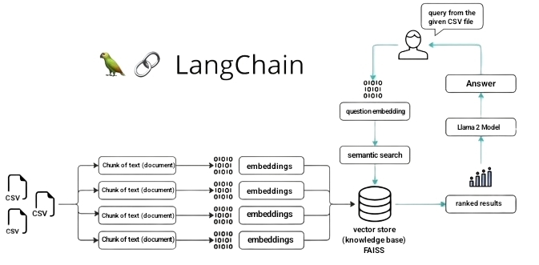

# 🦙 Llama-2-GGML-CSV-Chatbot 🤖

## Overview
The **Llama-2-GGML-CSV-Chatbot** is a conversational tool powered by a fine-tuned large language model (LLM) known as *Llama-2 7B*. This chatbot utilizes CSV retrieval capabilities, enabling users to engage in multi-turn interactions based on uploaded CSV data.



## 🚀 Features

- **CSV Data Interaction:** Allows users to engage in conversations based on uploaded CSV data.
- **Multi-turn Interaction:** Supports seamless multi-turn interactions for a better conversational experience.

## Development Specs
- Utilizes [Llama-2 7B](https://huggingface.co/TheBloke/Llama-2-7B-Chat-GGML/tree/main) and [Sentence Transformers](https://huggingface.co/sentence-transformers/all-MiniLM-L6-v2) for robust functionality.
- Developed using [Langchain](https://github.com/langchain-ai/langchain) and [Streamlit](https://github.com/streamlit/streamlit) technologies for enhanced performance.
- Cross-platform compatibility with Linux, macOS, or Windows OS.

## 🛠️ Installation

1. **Clone the Repository:**
   ```bash
   git clone https://github.com/ThisIs-Developer/Llama-2-GGML-CSV-Chatbot.git
   ```
2. **Install Dependencies:**
   ```bash
   pip install -r requirements.txt
   ```

### Download the Llama 2 Model:

Download the Llama 2 model file named `llama-2-7b-chat.ggmlv3.q4_0.bin` from the following link:

[🔗Download Llama 2 Model](https://huggingface.co/TheBloke/Llama-2-7B-Chat-GGML/tree/main)

### Llama 2 Model Information

| Name                           | Quant method | Bits | Size    | Max RAM required |
|--------------------------------|--------------|------|---------|------------------|
| llama-2-7b-chat.ggmlv3.q4_0.bin | q4_0         | 4    | 3.79 GB | 6.29 GB          |

**Note:** After downloading the model, add the model file to the `models` directory. The file should be located at `models\llama-2-7b-chat.ggmlv3.q4_0.bin`, in order to run the code.

## 📝 Usage

1. **Run the Application:**
   ```bash
   streamlit run app.py
   ```
2. **Access the Application:**
   - Once the application is running, access it through the provided URL.
   - 
## System Requirements
- **CPU:** Intel® Core™ i5 or equivalent.
- **RAM:** 8 GB.
- **Disk Space:** 7 GB.
- **Hardware:** Operates on CPU; no GPU required.

## 🤖 How to Use

- Upon running the application, you'll be presented with a sidebar providing information about the chatbot and an option to upload a CSV file.
- Upload a CSV file containing the data you want the chatbot to interact with.
- Enter your query or prompt in the input field provided.
- The chatbot will process your query and generate a response based on the uploaded CSV data and the Llama-2-7B-Chat-GGML model.

## 📖 ChatBot Conversession

### ⚡Streamlit ver. on [#v2.0.2.dev20240102](https://github.com/ThisIs-Developer/Llama-2-GGML-CSV-Chatbot/releases/tag/v2.0.2.dev20240102)


## 📌 Important Notes

- While robust, this chatbot is not a substitute for professional advice.
- Ensure the CSV file adheres to the expected format for optimal performance.

## 🤝 Contributing

Contributions and suggestions are welcome! Feel free to fork the repository, make changes, and submit pull requests for improvements or bug fixes.

## 📄 License

This project is licensed under the [MIT License](https://github.com/ThisIs-Developer/Llama-2-GGML-CSV-Chatbot/blob/main/LICENSE).

